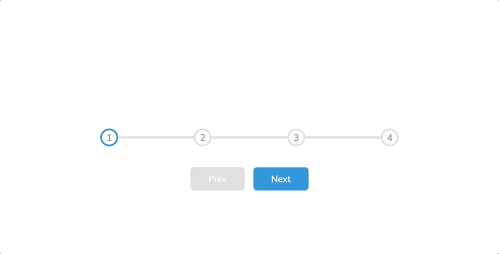

# 🧭 Progress Steps

This is an interactive **Progress Steps** component that visually shows a user's progress through multiple steps.  
Ideal for multi-step forms or onboarding processes.

---

## 📸 Demo

<p align="center">
  
</p>

---

## 🚀 Features
- Smooth transition between steps ✨  
- Simple and clean design 🎨  
- Perfect for multi-step forms or registration processes  

---

## 🛠️ Technologies Used
- HTML  
- CSS  
- JavaScript  

---

## 📂 How to Use
1. Clone the repo:
   ```bash
   git clone https://github.com/JehanAB/ProgressSteps.git
